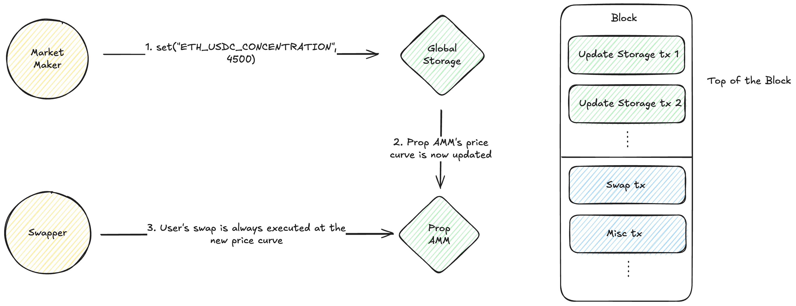

## Global Storage

A neutral, permissionless, key-value store that enables high-performance, onchain market making on Layer 2 EVM chains by providing a mechanism for cheap, Top-of-Block (ToB) oracle updates.



### Why ToB?

In the context of Prop AMMs, putting update transactions at the Top of Block ensures that all swap transactions in the block use the freshest price curve.

This protects market makers from toxic traders who may attempt to front-run the Prop AMM's price curve update, by allowing the market maker to cheaply land price curve updates at the top of the block, resulting in the market maker being able to provide tighter quotes.

With a builder that treats `to == GlobalStorage` transactions as ToB, latency-sensitive oracle updates can land at the top of the block without allowlists or privileged keys.

### Core Idea

- Block builders implement a policy where any transaction whose `to` equals `GlobalStorage` is treated by builders as an “oracle update” and moved into the ToB tranche. Inside the tranche is ordered by priority fee (similar to a local fee market).
- The contract is minimal and neutral: it only allows setting/getting values in storage slots namespaced by the sender’s address.
- Writers call `set(bytes32 key, bytes32 value)` or `setBatch(keys, values)`.
- Readers fetch values via `get(address owner, bytes32 key)`.
- Namespacing: `mapping(address => mapping(bytes32 => bytes32))` to ensure writers only mutate their own keys.

### Actors and Flows

- Writer (market maker):
  1. Compute `key = keccak256(abi.encode(tokenIn, tokenOut))` (or another agreed schema).
  2. Submit transaction with `tx.to = GlobalStorage`, calling `set(key, value)`.
  3. Builder policy places this tx in the ToB tranche.

- Reader (Prop AMM):
  - Read `GlobalStorage.get(owner, key)` for values that determine the Prop AMM's price curve. For freshness, rely on ToB builder policy and/or encode freshness within the stored `bytes32` (e.g., sequence number) and verify it in the consumer.

- Builders/Proposers:
  - Adopt a policy: all `to == GlobalStorage` txs receive ToB ordering, where transactions inside the ToB section are ordered by priority fee.

### Contract Overview

Main functions exposed by `src/IGlobalStorage.sol` / `src/GlobalStorage.sol`:

- `set(bytes32 key, bytes32 value)`
- `setBatch(bytes32[] keys, bytes32[] values)`
- `get(address owner, bytes32 key) -> bytes32`

Events:

- `GlobalValueSet(owner, key, value, blockNumber, timestamp)`
- `GlobalValuesSet(owner, keys, values, blockNumber, timestamp)`


- Solidity interface (MVP):

```solidity
/// @notice Neutral, namespaced key-value store for ToB oracle updates.
interface IGlobalStorage {
    /// @dev Sets a value in the caller's namespace.
    function set(bytes32 key, bytes32 value) external;

    /// @dev Sets multiple values in the caller's namespace.
    function setBatch(bytes32[] calldata keys, bytes32[] calldata values) external;

    /// @dev Reads a value in `owner`'s namespace.
    function get(address owner, bytes32 key) external view returns (bytes32);

    /// @dev Emitted on single write.
    event GlobalValueSet(
        address indexed owner,
        bytes32 indexed key,
        bytes32 value,
        uint64 blockNumber,
        uint64 timestamp
    );

    /// @dev Emitted on batch write.
    event GlobalValuesSet(
        address indexed owner,
        bytes32[] keys,
        bytes32[] values,
        uint64 blockNumber,
        uint64 timestamp
    );
}
```

- Storage layout:
  - `mapping(address => mapping(bytes32 => bytes32)) valueOf;`

- Behavior:
  - `set` and `setBatch` update value; emit events.
  - No reentrancy (no external calls), no governance.

#### Keying Scheme

- Token pair key (directional):
  - `bytes32 key = keccak256(abi.encode(tokenIn, tokenOut))`.
- Canonicalized pair (unordered):
  - Sort addresses and encode: `keccak256(abi.encode(min(tokenA, tokenB), max(tokenA, tokenB)))`.
- Rich schema examples:
  - `keccak256(abi.encode("PAIR_PRICE_Q64_64", tokenIn, tokenOut))`.
  - `keccak256(abi.encode("ASSET_TWAP", token, windowSec))`.
  - `keccak256(abi.encode("VERSIONED", tokenIn, tokenOut, uint256(version)))`.

#### Example Usage

- Writer (price push):

```solidity
bytes32 key = keccak256(abi.encode(tokenIn, tokenOut));
bytes32 priceQ64_64 = bytes32(uint256(priceX128 >> 64)); // example encoding
IGlobalStorage(GLOBAL_STORAGE_ADDR).set(key, priceQ64_64);
```

- Reader (during swap):

```solidity
bytes32 value = IGlobalStorage(GLOBAL_STORAGE_ADDR).get(oracleWriter, key);
```

#### Open Questions

- What % of each block do we allocate for just these global storage transactions?
- Is a local fee market enough to avoid spam?

### Quick Start (Foundry)

#### Build

```shell
$ forge build
```

#### Test

```shell
$ forge test
```

Run verbose tests for this project’s suite (see `test/GlobalStorage.t.sol`):

```shell
$ forge test -vv
```

#### Format

```shell
$ forge fmt
```

#### Gas Snapshots

```shell
$ forge snapshot
```

#### Local Node (Anvil)

```shell
$ anvil
```

### Deploy

Deploy the contract with Foundry:

```shell
$ forge create src/GlobalStorage.sol:GlobalStorage \
  --rpc-url <your_rpc_url> \
  --private-key <your_private_key>
```

Alternatively, use your own deployment script.

### Integration Snippets

Writer pushes a value under their namespace:

```solidity
bytes32 key = keccak256(abi.encode(tokenIn, tokenOut));
bytes32 priceQ64_64 = bytes32(uint256(priceX128 >> 64));
IGlobalStorage(GLOBAL_STORAGE_ADDR).set(key, priceQ64_64);
```

Reader fetches and enforces freshness in the same block:

```solidity
bytes32 value = IGlobalStorage(GLOBAL_STORAGE_ADDR).get(oracleWriter, key);
```

For more context, examples, and keying schemes, see the design sections above and the tests in `test/GlobalStorage.t.sol`.

### Notes

- ToB behavior depends on off-chain builder/relay policy; the contract itself is neutral and permissionless.
- Each sender writes only to their own namespace (`msg.sender`). Consumers should read from trusted `owner` addresses.

### License

MIT

### Foundry Docs

https://book.getfoundry.sh/
